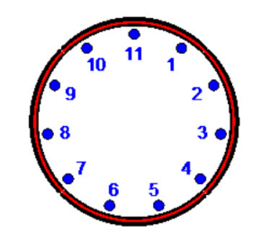
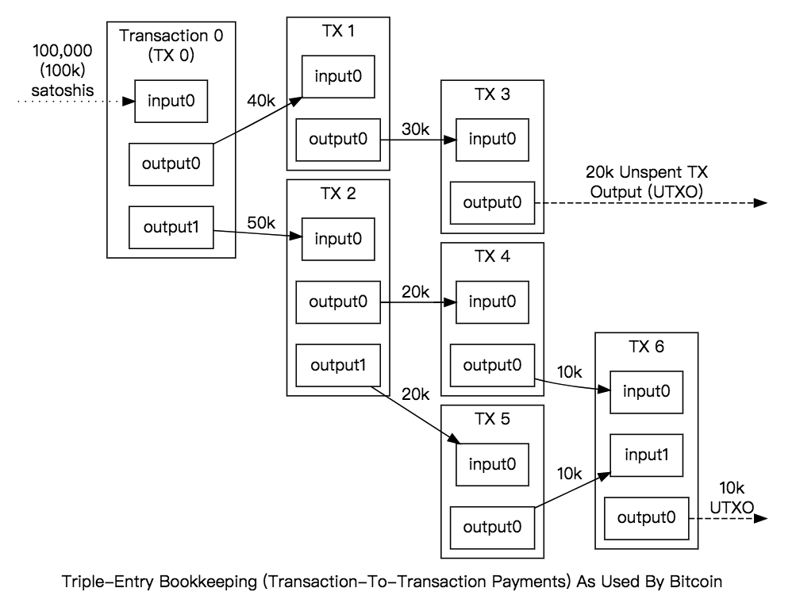

# rust_mimblewimble_tutorial

```Rust
:dep curve25519-dalek = "1.1.3"
rand = "0.6.5"
sha2 = "0.8.0"
```


```Rust
extern crate curve25519_dalek;
extern crate rand;
extern crate sha2;

use curve25519_dalek::constants;
use curve25519_dalek::ristretto::CompressedRistretto;
use curve25519_dalek::ristretto::RistrettoPoint;
use curve25519_dalek::scalar::Scalar;

use rand::prelude::*;

use sha2::{Sha256, Digest};

let mut rng = rand::thread_rng();
```

## Discrete logarithm problem



- given the Generator G = 3 and the point P = 2 it is extremely difficult (assuming large numbers) to get the multiplicator r that satisfies

P = r G

- however, knowing r it is easy to compute P

## Schnorr signatures

- private key r, public key U with

U = rG

- signer generates nonce r_t and computes commitment to nonce

U_t = r_t G

- using challenge c=H(m,U_t) signer computes

r_z = r_t + c r
- signer sends (U_t,r_z) to verifier
- verifier checks

r_z G = U_t + cU


```Rust
//get generator for the elliptic curve points
let G = &constants::RISTRETTO_BASEPOINT_POINT;

//pick arbitrary private key
let r = Scalar::from_bytes_mod_order([2u8;32]);

//compute public key
let U = r*G;

//generate random nonce, has to be different every time
let mut temp: [u8;32] = [0u8;32];
temp.copy_from_slice((0..32).map(|x| rng.gen()).collect::<Vec<u8>>().as_slice());
let rt = Scalar::from_bytes_mod_order(temp);

//calculate commitment to nonce
let Ut = rt*G;

//generate challenge from hashfunction
let mut hasher = Sha256::new();
hasher.input("message".as_bytes());
hasher.input(Ut.compress().to_bytes());
temp.copy_from_slice(hasher.result().as_slice());
let c = Scalar::from_bytes_mod_order(temp);

let rz = rt + c*r;

//check whether signature is valid
assert_eq!(rz*G,Ut+c*U);

(rz*G).compress()
```


    CompressedRistretto: [154, 148, 183, 221, 194, 76, 149, 120, 47, 75, 175, 107, 10, 50, 71, 59, 180, 157, 11, 218, 188, 58, 218, 25, 122, 242, 152, 70, 74, 122, 105, 99]


## UTXO transactions



## Example transaction

- lets look at a transaction with one input vi1 and two outputs vo1,vo2
- in order to not generate money out of nothing, the inputs must equal the ouputs

vi1 = vo1 + vo2
- lets consider for example the input vi1 = 40 and the outputs vo1 = 25, vo2=15


```Rust
let zeros: [u8;32] = [0u8;32];

let mut vi1 = zeros.clone();
vi1[0] = 40u8;
let vi1 = Scalar::from_bytes_mod_order(vi1);

let mut vo1 = zeros.clone();
vo1[0] = 25u8;
let vo1 = Scalar::from_bytes_mod_order(vo1);

let mut vo2 = zeros.clone();
vo2[0] = 15u8;
let vo2 = Scalar::from_bytes_mod_order(vo2);

//check whether input equals output
assert_eq!(vi1,vo1+vo2);

vi1
```


    Scalar{
    	bytes: [40, 0, 0, 0, 0, 0, 0, 0, 0, 0, 0, 0, 0, 0, 0, 0, 0, 0, 0, 0, 0, 0, 0, 0, 0, 0, 0, 0, 0, 0, 0, 0],
    }


## Hiding

- in order to obscure the values of the transaction, one can multiply every term by the point H on an elliptic curve, this yields

vi1 H = vo1 H + vo2 H
- similar to the dlog problem, for people not knowing vi1, vo1, vo2 it is almost impossible to obtain them now
- however, the inputs must still equal the outputs


```Rust
//get point on the curve, it is important that the relation between G and H is unknown
let H = RistrettoPoint::random(&mut rng);

assert_eq!(vi1*H,vo1*H+vo2*H);

(vi1*H).compress()
```


    CompressedRistretto: [122, 187, 191, 22, 46, 11, 11, 181, 127, 84, 183, 76, 93, 147, 255, 220, 55, 29, 175, 37, 13, 35, 254, 139, 168, 168, 160, 80, 210, 246, 51, 106]


## Blinding

- the problem now is that, the people that transacted with you know the value of the transactions values and it gets easy for them to deduce your following transactions
- thats why every input or output gets replaced by its corresponding pedersen commitment

rG + vH

- where $r$ is called blinding factor and $G$ is another point on the curve
- in the context of mimblewimble $r$ can be thought of as a private key to the corresponding output and is only known by the owner of that output


```Rust
//initialize the blinding factors

let mut ri1 = zeros.clone();
ri1[0] = 20u8;
let ri1 = Scalar::from_bytes_mod_order(ri1);

let mut ro1 = zeros.clone();
ro1[0] = 34u8;
let ro1 = Scalar::from_bytes_mod_order(ro1);

let mut ro2 = zeros.clone();
ro2[0] = 11u8;
let ro2 = Scalar::from_bytes_mod_order(ro2);

//calculate the commitments


```
